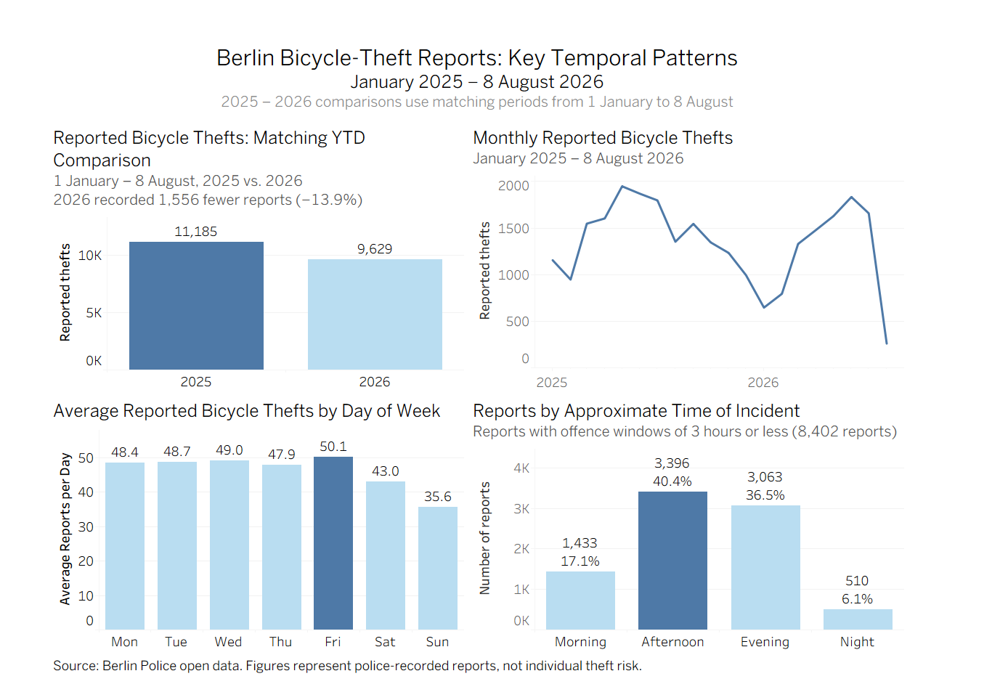
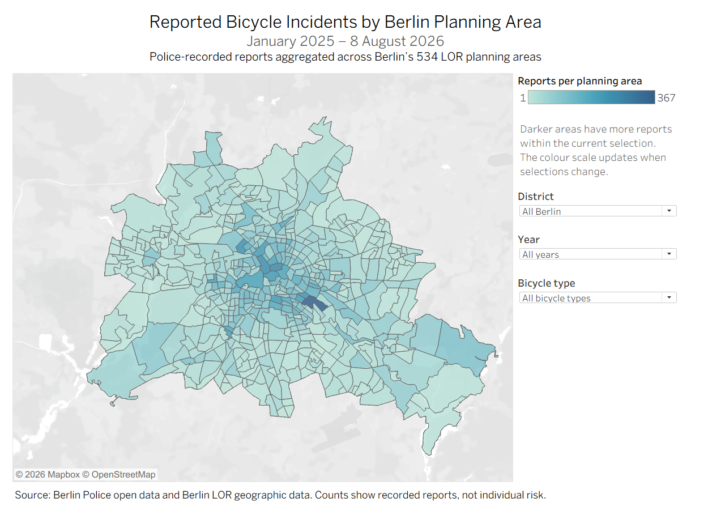
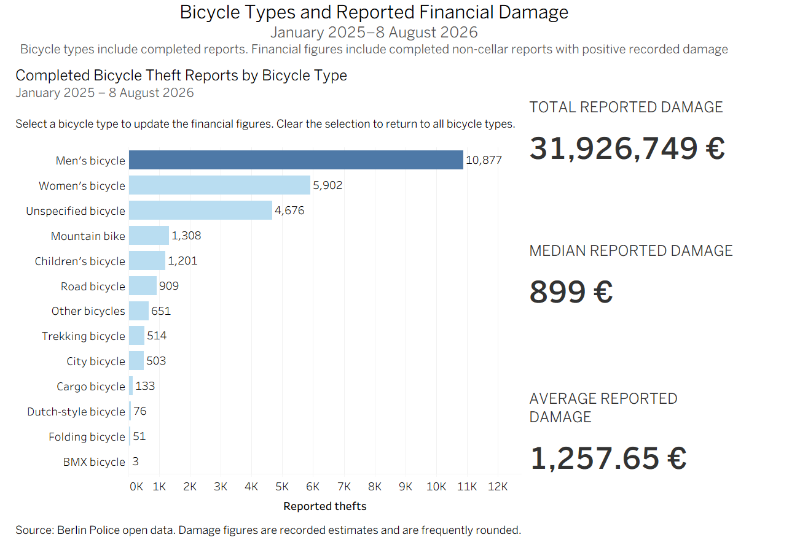

# Dude, Where’s My Bike?

## A Data-Driven Analysis of Reported Bicycle Incidents in Berlin

This project examines police-recorded reports about stolen bicycles in Berlin. Our goal was to explore where and when incidents were recorded, which bicycle types appeared most often, and how much financial damage was reported.

The project combines data preparation, Python analysis, SQL, geographic data and three interactive Tableau dashboards.

## Research Questions

We focused on four main questions:

1. Where are reports concentrated?
2. When do incidents happen?
3. Which bicycle types appear most often?
4. How much financial damage is recorded?

## Dataset

The main dataset was published by the Berlin Police through Berlin Open Data.

It contains:

* 26,965 police-recorded reports
* Records from 1 January 2025 to 8 August 2026
* All 12 Berlin districts
* 534 LOR planning areas

Additional data was used for:

* Berlin LOR planning-area boundaries
* District population figures

### Important date limitation

The 2026 data ends on 8 August 2026. Therefore, complete 2025 totals should not be compared directly with incomplete 2026 totals.

For year-over-year comparisons, we used matching periods:

* 1 January–8 August 2025: 11,185 reports
* 1 January–8 August 2026: 9,629 reports
* Difference: 1,556 fewer reports in 2026, a decrease of 13.9%

## Project Workflow

### 1. Data preparation and validation

The data was cleaned and prepared in Python. This included:

* Checking missing and duplicate records
* Converting date and time columns
* Creating year, month, weekday and weekend variables
* Grouping approximate incident times
* Preparing bicycle-type categories
* Preparing financial-damage fields
* Connecting report data with Berlin LOR planning areas
* Checking totals and calculated results

### 2. SQL analysis

SQL was used to reproduce and verify the main results, including:

* Report counts by year and matching period
* Monthly trends
* Weekday and weekend comparisons
* District and planning-area counts
* Bicycle-type counts
* Total, median and average recorded damage

### 3. Tableau dashboards

Three Tableau dashboards were created.

#### Temporal Patterns

This dashboard includes:

* Matching-period comparison between 2025 and 2026
* Monthly report trends
* Average reports by weekday
* Approximate time of incident

#### Planning-Area Map

This interactive map displays report counts across Berlin’s 534 planning areas.

Users can explore the map by:

* District
* Year
* Bicycle type

Darker areas have more reports within the current selection. The map shows aggregated counts, not exact incident locations or personal risk.

#### Bicycle Types and Financial Damage

This dashboard shows:

* Completed reports by bicycle type
* Total recorded damage
* Median recorded damage
* Average recorded damage

Selecting a bicycle type updates the financial figures.

The financial analysis uses completed non-cellar reports with positive recorded damage.

## Key Findings

* Reports decreased by 13.9% in the matching period from 2025 to 2026.
* Friday had the highest average number of reports per day, while Sunday had the lowest.
* The weekend daily average was approximately 19.5% lower than the weekday average.
* Mitte had the highest total district count, but Friedrichshain-Kreuzberg had the highest number of reports per 10,000 residents.
* Alt-Treptow had the highest planning-area count, with 367 reports.
* Men’s bicycles were the most frequently recorded bicycle type.
* The total recorded damage in the financial analysis was approximately €31.9 million.
* The median recorded damage was €899.
* Cargo bicycles had fewer reports but the highest median recorded damage, at €3,000.

## Tools

* Python
* Pandas
* Matplotlib and Seaborn
* SQL
* Tableau
* Google Colab
* Berlin LOR geographic data

## Repository Contents

* `notebooks/` – Python data preparation and analysis
* `sql/` – Database and analysis queries
* `tableau/` – Packaged Tableau workbook
* `visualisations/` – Dashboard and chart images
* `data/` – Processed data or data-download instructions
* `docs/` – Data dictionary and methodology
* `presentation/` – Final presentation

## Limitations

* The data contains police-recorded reports and may not represent every incident.
* The 2026 dataset only covers the period through 8 August.
* Planning-area counts are not automatically adjusted for population.
* Approximate incident-time results only use reports with an incident window of three hours or less.
* Financial-damage values are recorded estimates and are frequently rounded.
* Different analyses use different subsets of the data, which are explained in the notebooks and dashboards.
* The results describe patterns in the recorded data and should not be interpreted as individual risk.

## Team Contributions

### Person 1 – Halyna Shabarovska

* Data collection and preparation
* Python cleaning and exploratory analysis
* Data validation
* Python visualisations
* District population comparison
* Interpretation and presentation development

### Person 2 – Selina Reuter

* SQL database and analysis queries
* Validation of results with SQL
* Tableau worksheets and dashboards
* Interactive LOR planning-area map
* Dashboard filters and interactions
* Interpretation and presentation development

### Shared Work

Both team members contributed to:

* Research questions
* Selection of methods
* Verification of findings
* Interpretation of results
* Final presentation
* Project documentation

## Data Sources

* [Berlin Police Open Data – add the exact dataset link]
* [Berlin LOR geographic data – add the exact link]
* [Berlin district population data – add the exact link]

## Tableau

### Temporal Patterns

### Planning-Area Map

### Bicycle Types and Financial Damage

Static previews are shown above. The packaged Tableau workbook is available in the `tableau/` folder.

## Authors

* Selina Reuter
* Halyna Shabarovska
